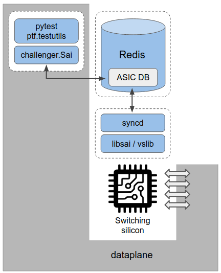

# SAI Challenger
SAI testing and integration framework that is based on SONiC sairedis project.

<a href="url"></a>


SAI Challenger can be executed in two modes:
1. [standalone mode](docs/standalone_mode.md) - both syncd and pytest are running in the same Docker container;
2. [client-server mode](docs/client_server_mode.md) - syncd and pytest are running in the separate Docker containers;

The standalone mode **SHOULD** be used in case of:
- running TCs on vslib SAI implementation;
- running TCs without traffic (without `--traffic` option) on HW;
- running TCs with/without traffic on ASIC simulator when it also runs inside the same Docker container as syncd;

The client-server mode **MUST** be used in case of:
- running TCs with traffic (with `--traffic` option) on HW;
- running TCs with traffic on ASIC simulator when it also runs inside the same Docker container as syncd but exposes ports outside the container;

The client-server mode **CAN** be used in all the cases defined for the standalone mode.

## SAI Challenger sources

To get SAI Challenger sources:
```sh
git clone https://github.com/PLVision/sai-challenger.git
cd sai-challenger/
git submodule update --init --recursive
```

## SAI Challenger internals

For more information on how SAI Challenger operates on SAI, please refer to [SAI operation](docs/sai_operation.md) document.

