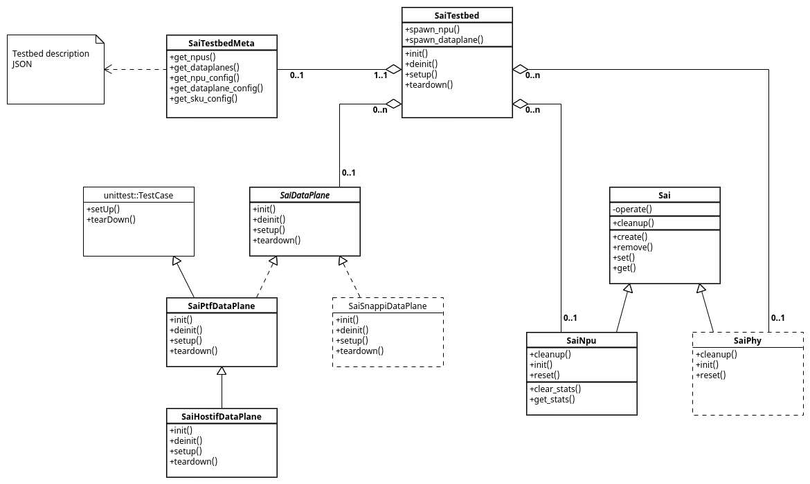

# SAI Challenger Architecture

## SAI Testbed

The `SaiTestbed()` class is a basic container for the target SAI testbed's components. It uses the testbed definition provided as a JSON file to spawn NPU, PHY and dataplane instances:

<a href="url"></a>

(created in http://www.umlet.com/umletino/umletino.html)

The `testbed_instance()` has a session scope and yields `SaiTestbed` object as per testbed's name provided through `--testbed` pytest parameter:
```sh
@pytest.fixture(scope="session")
def testbed_instance(exec_params):
    testbed_name = exec_params.get("testbed", None)
    if testbed_name is None:
        yield None
    else:
        testbed = SaiTestbed(testbed_name)
        testbed.init()
        yield testbed
        testbed.deinit()
```

The testcases SHOULD use a `testbed()` fixture - a wrapper around `testbed_instance` that performs per testcase `setup()` and `teardown()` of the testbed:
```sh
@pytest.fixture(scope="function")
def testbed(testbed_instance):
    if testbed_instance:
        testbed_instance.setup()
        yield testbed_instance
        testbed_instance.teardown()
    else:
        yield None
```

The testcase SHOULD use the `testbed` as follows:
```sh
def test_my_test(testbed):
    npu = testbed.dut[0]
    dataplane = testbed.dataplane[0]

    vlan_oid = npu.create(SaiObjType.VLAN, ["SAI_VLAN_ATTR_VLAN_ID", "10"])
    if npu.run_traffic:
        macs = ['00:11:11:11:11:11', '00:22:22:22:22:22']
        pkt = simple_tcp_packet(eth_dst=macs[1],
                                eth_src=macs[0])

        send_packet(dataplane, 0, pkt)
        verify_packets(dataplane, pkt, [1])
    npu.remove(vlan_oid)
```


## SAI Abstruction

<a href="url"></a>
