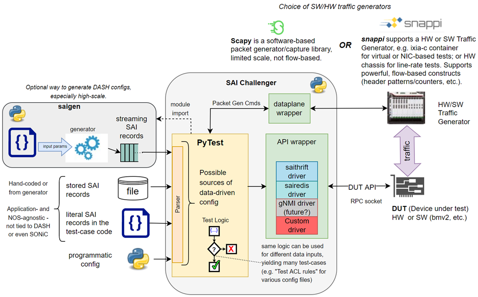

# Table of content

1. [About DASH Testing](#about-dash-testing)
0. [Testing topology](#testing-topology)
0. [How SAI-Challenger is used by DASH infra](#how-sai-challenger-is-used-by-dash-infra)
0. [How to setup DASH testing environment](#how-to-setup-dash-testing-environment)
0. [How to run TCs](#how-to-run-tcs)
0. [How do we use OTG there](#how-do-we-use-otg-there)

# About DASH Testing

To design a framework that can fit to DASH testing stages from stage 2 to stage 5. See stages description at [DASH test maturity stages](https://github.com/Azure/DASH/blob/main/test/docs/dash-test-maturity-stages.md)

# Testing topology

DASH verification use case uses only *client-server mode* of SAI-Challenger:

<a href="url"></a>

The difference with the standard SAI-Challenger topology:

## Server side

Two dockers are used instead of saivs:
1. BMv2 switch
2. SAI-Thrift Server

## Client side

Client docker is based on the original sai-challenger client image + it contains `sai_thrift` libs generated for SAI DASH headers with additional [`dpugen`](https://pypi.org/project/dpugen/) requirements.

## Dataplane side

All the same

# How SAI-Challenger is used by DASH infra

## Original DASH pipeline

[**Here**](https://github.com/Azure/DASH/blob/main/test/docs/dash-test-workflow-saithrift.md) is the description what happens when CI (or user) invokes `make all` & `make run-all-tests`.

## General changes in DASH repository after introducing SAI-Challenger
* Added [SAI-Challenger](https://github.com/opencomputeproject/SAI-Challenger) submodule by path: `DASH/test/SAI-Challenger`.
* Added test cases for SAI-Challenger by path: `DASH/test/test-cases/scale/saic`

## New make targets for *dash-pipeline*
**`docker-saichallenger-client`**: Build SAI-Challenger docker image and docker image based on SAI-Challenger client docker image with sai_thrift, saigen and DASH files.

**`run-saichallenger-client`**: Start Ixia-C and docker container `sc-client-thrift-run` from image built on `docker-saichallenger-client` target. To the original SAI-Challenger tests (`DASH/test/SAI-Challenger/tests`) folder a new folder `dash_tests` mounted from `DASH/test/test-cases/scale/saic` folder inside of container. Bound mount volume with DASH folder.

**`kill-saichallenger-client`**: Stop Ixia-C and `sc-client-thrift-run` container.

**`run-saichallenger-tests`**: Run test manually. This target may be triggered with passing parameters, or with default parameters.
Run with default parameters(Setup file: `sai_dpu_client_server_snappi.json`; Test: `test_sai_vnet_*.py`):
```
make run-saichallenger-tests
```

Run with setup parameter and default test parameter (All tests):
```
make run-saichallenger-tests <setup_file>
```

Run with setup parameter and test parameter:
```
make run-saichallenger-tests <setup_file> <test_name>
```

## New SAI-Challenger API's introduces in DASH

<a href="url"></a>

Where:

`saigen` - 3d party package - `dpugen`. It generates scalable SAI configuration for DPU use cases.

`parser` - command processor Sai.CommandProcessor defined in [`sai.py`](../../common/sai.py).

`API wrapper` - sai clients from [sai_client](../../common/sai_client/).

Used APIs for test design:
1. Streaming standard SAI notations via command processor. Used for big scale configuration scenarios.
1. Loading standard SAI notation from file or Python dictionary and push it to DPU via command processor.
1. Programmatic config - using SAI-Challenger's CRUD methods directly in the test code.

# How to setup DASH testing environment

## Pre-setup
Install dependencies listed [**here**](https://github.com/chrispsommers/DASH/blob/saichallenger-merge/dash-pipeline/README.md#prerequisites).

## Prepare repository
```
git clone https://github.com/sonic-net/DASH.git
cd DASH
git submodule update --init --recursive
```

## Build environment
```
cd dash-pipeline
make clean ;# skip on a fresh setup as it will fail
make all

pwd
```

## Start environment
Run in the 3 separate windows/tabs.
- take the output of `pwd` from previous step and do `cd <that location from pwd>` in each window
- window 1: `make run-switch`
- window 2: `make run-saithrift-server`
- window 3: will be used to run the test as per instructions bellow

# How to run TCs

## Using make target
Run all available VNET tests:
```sh
make run-saichallenger-tests
```

Run tests in DASH configuration format with the custom options*:
```sh
make run-saichallenger-tests sai_dpu_client_server_snappi.json test_sai_vnet_inbound.py
make run-saichallenger-tests sai_dpu_client_server_snappi.json test_sai_vnet_outbound_simple.py
make run-saichallenger-tests sai_dpu_client_server_snappi.json test_sai_vnet_outbound_scale.py
```

Run tests in SAI configuration format with custom options*:
```sh
make run-saichallenger-tests sai_dpu_client_server_snappi.json test_config_vnet_inbound.py
make run-saichallenger-tests sai_dpu_client_server_snappi.json test_config_vnet_outbound.py
```
*The run-saichallenger-tests target runs two sets of test cases that can be executed separately - run-saichallenger-scale-tests or run-saichallenger-functional-tests.

## Manually from the docker (developers mode)
Run the `dash-saichallenger-client-$USER` container.
```sh
make run-saichallenger-client-bash
```

And execute tests in DASH configuration format (inside the container):
```sh
cd scale/
pytest -sv --setup=sai_dpu_client_server_snappi.json test_sai_vnet_inbound.py
pytest -sv --setup=sai_dpu_client_server_snappi.json test_sai_vnet_outbound_simple.py
pytest -sv --setup=sai_dpu_client_server_snappi.json test_sai_vnet_outbound_scale.py
```

Or in SAI configuration format:
```sh
pytest -sv --setup=sai_dpu_client_server_snappi.json test_config_vnet_inbound.py
pytest -sv --setup=sai_dpu_client_server_snappi.json test_config_vnet_outbound.py
```

# How do we use OTG there

OTG is used only if `snappi` dataplane is selected.

DASH pipeline uses Ixia-C by default and starts appropriate docker containers automatically on `make run-saichallenger-tests`.

There are two ways of using OTG:
- PTF compatible traffic API
- Native OTG traffic API

**OTG PTF compatible mode** uses same traffic API as in `ptf.testutils`.
- Tests are compatible for both PTF and OTG dataplanes
- Implementation - [`ptf_testutils.py`](../../dataplane/ptf_testutils.py)
- Tests MUST use import `from dataplane.ptf_testutils import *` instead of `from ptf.testutils import *`
- PTF compatible mode can be used in combination with native OTG approach

Tests could be designed using **native OTG traffic API**:
- Test won't be compatible with PTF dataplane
- Direct snappi API may be used in tests. Alternatively some functions can be placed in [`snappi_traffic_utils.py`](../../dataplane/snappi/snappi_traffic_utils.py)
- ptf_testutils can be used as well

There is no specific options or flags that should be set during the test run to identify which mode is used. The difference between two modes in test writing style. It is recommended to use pytest.marks to be able to filter one test type from another.